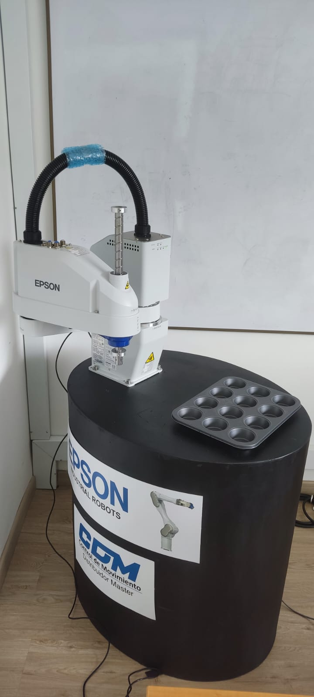
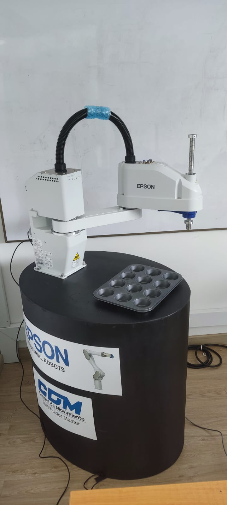
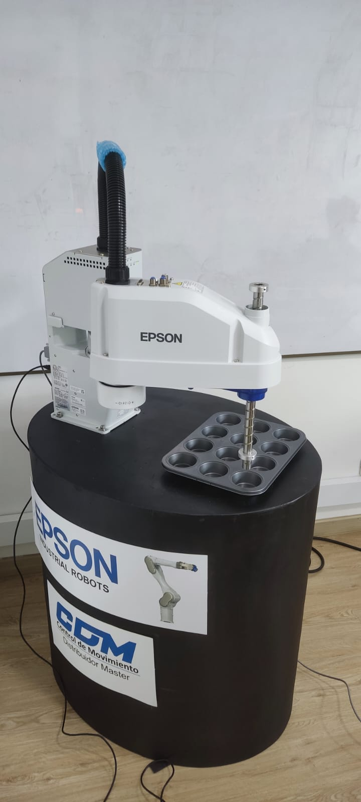
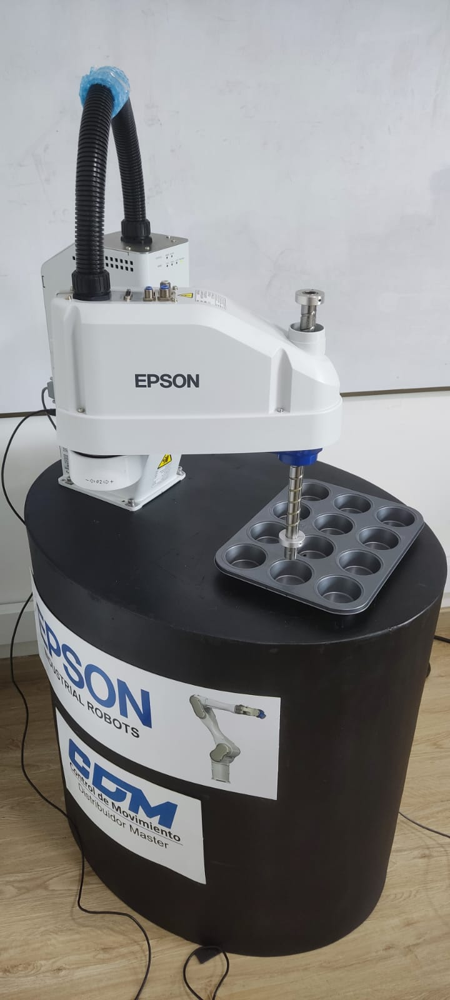
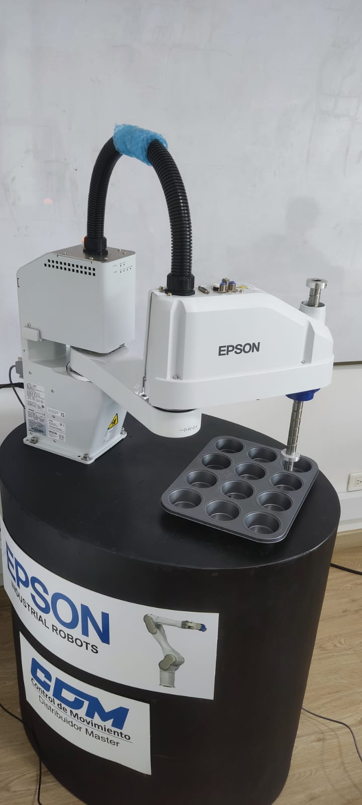

# Laboratorio EPSON-Robótica

- Juan Nicolás Carvajal Useche
- Edgar Giovanny Obregón Espitia

## Disclaimer: Dado que el profesor en la fecha de la realización de este proyecto dijo que esto no se tenía que subir o presentar de ninguna manera, no se realizaron copias de seguridad de algunos archivos fuente. Desgraciadamente al día de hoy el computador con el que se realizó esta práctica se dañó por lo que no se pudieron recuperar estos archivos.

------------------------------------------------------------------------------------------------------------------------------------------------------------------------------

## Descripción de la solución planteada

El objetivo de esta práctica es familiarizarse con los robot de la marca EPSON. Para esto se realizó una práctica con el robot SCARA-T3 donde se requería realizar unas rutinas de paletizado haciendo secuencias en S, Z y con un offset. Inicialmente la matriz de paletizado era 3x2, pero con el offset esta es de 4x3. El primer paso es hacer el programa SPEL+ y realizar las simulaciones, aquí se implementan ciclos y condicionales para seleccionar las rutinas. Esto será explicado en una sección más adelante.

Dentro de la práctica, el primer paso es conectar el controlador del robot al programa ya creado, a partir de este y en el computador se definen los límites articulares para prevenir colisiones o accidentes moviendo el robot a las posiciones de los límites dispuestas. Las imágenes a continuación muestran los 3 puntos escogidos para definir los límites articulares.

  

Estos puntos son guardados. El siguiente paso ahora es calibrar el workobject de la paleta, para esto se mueve una vez más el robot a las posiciones deseadas para el origen, un punto sobre el eje x y un punto sobre el eje y. Estos tres puntos se muestran en las imágenes a continuación.

Estos puntos también son guardados.

Ya teniendo definido tanto el workobject como los límites articulares, se selecciona la velocidad y aceleración que se le quiere imponer a las rutinas, inicialmente se prueba a velocidades bajas para verificar, pero después para que sea más ágil el proceso se suben estas variables.

## Explicación del código

## Demostración en videos

--------------------------------------------------------------------------------------------------------------------------------------
