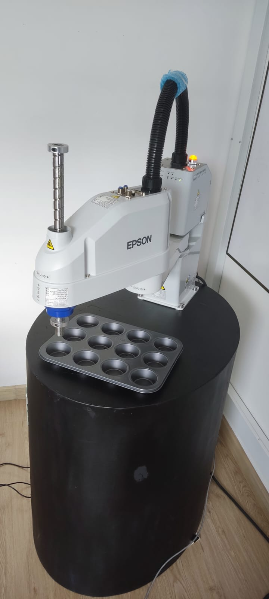

# Laboratorio EPSON-Robótica

- Juan Nicolás Carvajal Useche
- Edgar Giovanny Obregón Espitia

## Disclaimer: Dado que el profesor en la fecha de la realización de este proyecto dijo que esto no se tenía que subir o presentar de ninguna manera, no se realizaron copias de seguridad de algunos archivos fuente. Desgraciadamente al día de hoy el computador con el que se realizó esta práctica se dañó por lo que no se pudieron recuperar estos archivos.

------------------------------------------------------------------------------------------------------------------------------------------------------------------------------

## Descripción de la solución planteada

El objetivo de esta práctica es familiarizarse con los robot de la marca EPSON. Para esto se realizó una práctica con el robot SCARA-T3 donde se requería realizar unas rutinas de paletizado haciendo secuencias en S, Z y con un offset. Inicialmente la matriz de paletizado era 3x2, pero con el offset esta es de 4x3. El primer paso es hacer el programa SPEL+ y realizar las simulaciones, aquí se implementan ciclos y condicionales para seleccionar las rutinas. Esto será explicado en una sección más adelante.

Dentro de la práctica, el primer paso es conectar el controlador del robot al programa ya creado, a partir de este y en el computador se definen los límites articulares para prevenir colisiones o accidentes moviendo el robot a las posiciones de los límites dispuestas. Las imágenes a continuación muestran los 3 puntos escogidos para definir los límites articulares.

  


Estos puntos son guardados. El siguiente paso ahora es calibrar el workobject de la paleta, para esto se mueve una vez más el robot a las posiciones deseadas para el origen, un punto sobre el eje x y un punto sobre el eje y. Estos tres puntos se muestran en las imágenes a continuación.


Estos puntos también son guardados.

Ya teniendo definido tanto el workobject como los límites articulares, se selecciona la velocidad y aceleración que se le quiere imponer a las rutinas, inicialmente se prueba a velocidades bajas para verificar, pero después para que sea más ágil el proceso se suben estas variables.

## Explicación del código
El programa ejecutado se divide en tres secciones aparte de la función principal. En esta sección, se ajustan los parámetros de velocidad, aceleración y torque del robot SCARA, además de definir los orígenes del pallet. Finalmente, se establece la acción a ejecutar según la modalidad de paletizado: ya sea paletizado en S, paletizado en Z o paletizado externo.

En el caso del paletizado Z, el cual se realiza fila tras fila comenzando siempre por la misma columna, se implementa un enfoque secuencial para la disposición de los elementos.

En contraste, el paletizado S sigue un patrón de disposición fila tras fila, intercalando las columnas con el objetivo de mejorar la eficiencia del proceso.

Por último, el paletizado externo se encarga de crear un pallet con una fila y una columna adicionales. En este contexto, el tamaño original del pallet, en nuestro caso, 3x3, se amplía a un formato de 4x4 para adaptarse a los requisitos específicos de la aplicación.
``` SPEL+
Function main
Motor On
Power High

Accel 100, 100
Speed 100

Pallet 1, Origen, Ejey, Ejex, 3, 3
Pallet Outside, 2, Origen, Ejey, Ejex, 3, 3
Do
	
	If Sw(9) Then
		Call paletizado_z
	EndIf
	If Sw(10) Then
		Call paletizado_s
	EndIf
	Call paletizado_externo
Loop


Fend

Function paletizado_z
	Integer i
	i = 1
	#define estado_paletizado_z 11
	On estado_paletizado_z
	For i = 1 To 9
		Jump Pallet(1, i)
	Next
	Off estado_paletizado_z
Fend
Function paletizado_s
	Integer i
	i = 1
	#define estado_paletizado_s 12
	On estado_paletizado_s
	For i = 1 To 3
		Jump Pallet(1, i)
	Next
	i = 6
	Do While i > 3
		Jump Pallet(1, i)
		i = i - 1
	Loop
	For i = 7 To 9
		Jump Pallet(1, i)
	Next
	Off estado_paletizado_s
Fend

Function paletizado_externo
	Integer i
	Integer j
	i = 1
	j = 1
	#define estado_paletizado_ex 13
	On estado_paletizado_ex
	For i = 1 To 4
		For j = 1 To 4
		Jump Pallet(2, i, j)
		Next
	Next
	Off estado_paletizado_ex
Fend
```

## Demostración en videos

A continuación, se presenta una breve demostración del robot SCARA en pleno funcionamiento mediante la ejecución de este código. Este video ilustra cómo el programa configura los parámetros esenciales, define los orígenes del pallet y, finalmente, ejecuta la acción correspondiente según la modalidad seleccionada: paletizado en S, paletizado en Z o paletizado externo. 


https://github.com/jcarvajalu/LaboratorioEPSON-Rob-tica/assets/82681128/c1a52888-491d-4aea-964b-6393912fa594


--------------------------------------------------------------------------------------------------------------------------------------
